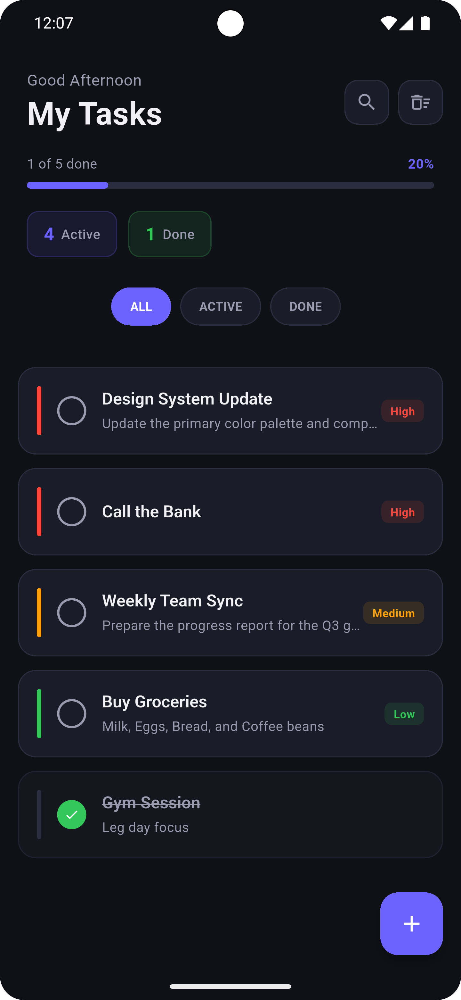
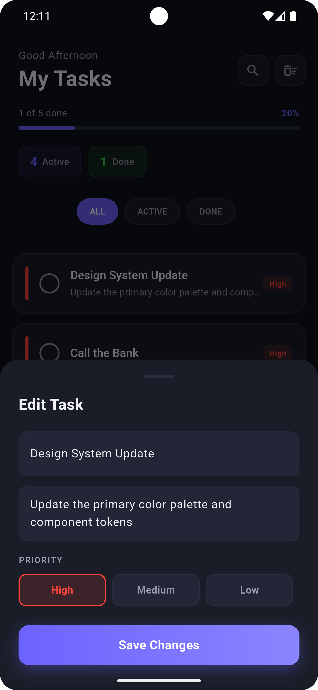
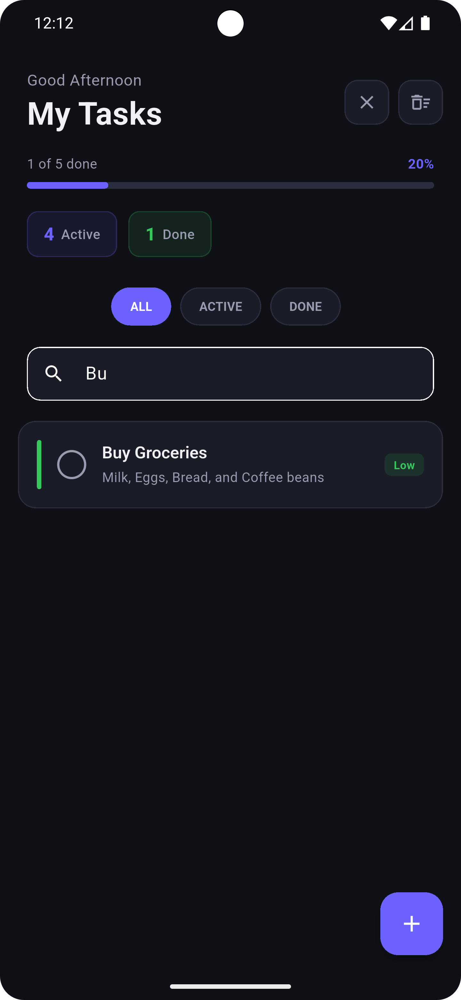
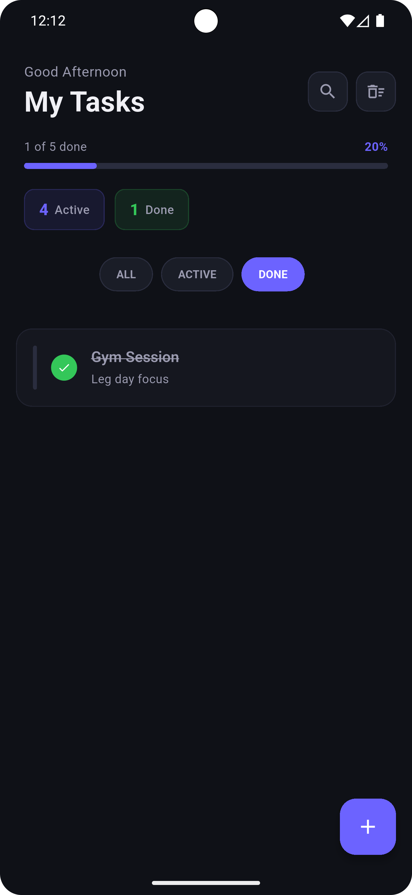

# ZenTask 📝

A sleek, minimalist Flutter To-Do application designed for focus and productivity. Featuring a modern dark UI, priority-based task management, and smooth animations.

---

## 📷 Screenshots

| Home Screen | Task Editor |
|:---:|:---:|
|  |  |

| Filter & Search | Task Completion |
|:---:|:---:|
|  |  |

---

## ✨ Features

- **Priority Management:** Categorize tasks by High, Medium, or Low priority.
- **Progress Tracking:** Visual progress bar and stats for active vs. completed tasks.
- **Smart Filtering:** Quickly toggle between All, Active, and Done tasks.
- **Search Functionality:** Find specific tasks instantly with the built-in search bar.
- **Interactive UI:** Swipe to delete, haptic feedback, and smooth transitions.
- **Modern Design:** Zen-inspired dark theme built with Material 3.

---

## 🛠️ Tech Stack

- Flutter & Dart
- Material 3 Design
- Inter Fonts
- Haptic Feedback Integration

---

## 🚀 Getting Started

### Prerequisites

- Flutter SDK
- Android Studio or VS Code
- Emulator or physical device

### Installation

1. Clone the repository
```bash
git clone https://github.com/mina-todri/todo.git
cd todo
```

2. Install dependencies
```bash
flutter pub get
```

3. Run the app
```bash
flutter run
```

---

## 📂 Project Structure

```
lib/
├── main.dart
├── models/
│   └── task.dart
├── theme/
│   └── app_colors.dart
└── widgets/
    ├── task_tile.dart
    ├── stat_widgets.dart
    └── bottom_sheets/
        └── task_editor.dart
```

---

## 👨‍💻 Author

**Mina Kamal** — Flutter Developer

[](https://github.com/mina-todri)
[](https://www.linkedin.com/in/mina-kamal-b56560313)
